# Master SEO Strategy & Content Intelligence Blueprint

> 🌐 **Live GitHub Repository:** [https://github.com/chasekn43/regulatory-archive-2026](https://github.com/chasekn43/regulatory-archive-2026)  
> 🌐 **Live Interactive Website:** [https://chasekn43.github.io/regulatory-archive-2026/](https://chasekn43.github.io/regulatory-archive-2026/)  
> 👤 **Author & Subject Entity:** Charles W. Kinslow IV, J.D., C.P.A. (`Chase Kinslow`)  
> 📅 **Document Version:** August 2026 | Enterprise Search Intelligence Standard  

---

## 1. Strategic Mandate & Executive Summary

This Master SEO Strategy and Content Intelligence Blueprint defines the holistic organic search, knowledge graph entity mapping, content optimization, and zero-latency indexation strategy for **Charles W. Kinslow IV's Regulatory Archive & Public Evidentiary Record** ([`chasekn43/regulatory-archive-2026`](https://github.com/chasekn43/regulatory-archive-2026)).

### Core Strategic Principles:

1. **Search Engines Index Context, Not Destination URLs:**  
   Search engines (Google, Bing, Yahoo, DuckDuckGo, Perplexity, ChatGPT Search) analyze semantic natural language intent, entity relationships, and topical authority. A URL (`https://github.com/chasekn43/regulatory-archive-2026` or `https://chasekn43.github.io/regulatory-archive-2026/`) is a web destination, **never a search keyword**. All SEO optimization, metadata markup, schema graphs, and automated rank tracking target high-intent, natural language legal, financial, and regulatory queries.

2. **Entity Knowledge Graph Domination:**  
   Establish explicit semantic triples connecting `Charles W. Kinslow IV, J.D., C.P.A.`, legal statutory frameworks (`Regulation Z 12 C.F.R. § 1026.13`, `APA 5 U.S.C. § 553`, `Dodd-Frank Title X UDAAP`), regulatory bodies (`Consumer Financial Protection Bureau`, `California AG`, `Louisiana AG`), and financial institutions (`Affirm, Inc.`, `Morgan Lewis & Bockius LLP`).

3. **Multi-Channel Audience Capture:**  
   Interception of search traffic across four key persona vectors: Regulators & Enforcement Officials, Legal Scholars & Attorneys, Financial & Tech Journalists, and Fintech Risk & Compliance Officers.

4. **Zero-Latency Indexation & Multi-Engine Distribution:**  
   Deploy automated IndexNow API submission tools, XML sitemaps, structured JSON-LD Schema `@graph` payloads, and static speed delivery to achieve rapid indexation across Google, Bing, Yahoo, DuckDuckGo, and AI search engines (Perplexity, ChatGPT Search, Gemini).

---

## 2. Knowledge Graph & Entity Architecture

Search engines construct graph networks connecting entities via semantic triples (`Subject` -> `Predicate` -> `Object`). This project is architected around a multi-tier Knowledge Graph network:

```mermaid
graph TD
    CK["Charles W. Kinslow IV, J.D., C.P.A.<br/>(Person / Author / Attorney)"]
    AF["Affirm, Inc. (NYSE: AFRM)<br/>(Fintech Lender)"]
    ML["Morgan, Lewis & Bockius LLP<br/>(Outside Defense Counsel)"]
    CFPB["Consumer Financial Protection Bureau<br/>(Federal Regulator)"]
    CAG["California Office of the AG<br/>(State Law Enforcement)"]
    LAG["Louisiana Department of Justice<br/>(State Law Enforcement)"]
    MPD["Monroe Police Department<br/>(Police Report #26-29572)"]
    
    REGZ["Regulation Z 12 C.F.R. § 1026.13<br/>(Billing Error Procedures)"]
    APA["APA 5 U.S.C. § 553<br/>(Notice & Comment Exemption)"]
    UDAAP["Dodd-Frank Title X UDAAP<br/>(12 U.S.C. § 5531)"]
    UCL["Cal. UCL § 17200 / FAL § 17500<br/>(Unfair Competition Law)"]
    
    CK -->|Filed Complaint Against| CFPB
    CK -->|Submitted Formal Evidence To| CAG
    CK -->|Submitted Dispute Notice To| LAG
    CK -->|Filed Criminal Identity Fraud Report| MPD
    CK -->|Authored Regulatory Archive| REPO["regulatory-archive-2026"]
    
    AF -->|Subject to Regulatory Audit| CFPB
    AF -->|Represented by Legal Counsel| ML
    AF -->|Governed by Federal Statute| REGZ
    AF -->|Governed by Administrative Law| APA
    AF -->|Bound by Consumer Care Rules| UDAAP
    AF -->|Subject to State UCL Action| UCL
```



### Semantic Triples Matrix:
- **`[Charles W. Kinslow IV]`** -> `[isAuthorOf]` -> `[Regulatory Archive 2026]`
- **`[Charles W. Kinslow IV]`** -> `[filedCFPBComplaint]` -> `[CFPB Complaint #260717-35668593]`
- **`[CFPB Complaint #260717-35668593]`** -> `[targetsEntity]` -> `[Affirm, Inc. (NYSE: AFRM)]`
- **`[Affirm, Inc.]`** -> `[isRepresentedBy]` -> `[Morgan, Lewis & Bockius LLP]`
- **`[Regulatory Archive 2026]`** -> `[analyzesStatute]` -> `[Regulation Z 12 C.F.R. § 1026.13]`
- **`[Regulatory Archive 2026]`** -> `[evaluatesExemption]` -> `[APA 5 U.S.C. § 553 Notice and Comment]`
- **`[Regulatory Archive 2026]`** -> `[documentsViolations]` -> `[Dodd-Frank Title X UDAAP 12 U.S.C. § 5531]`

---

## 3. Tangential Search Opportunity Matrix & Keyword Clusters

The search strategy targets **8 distinct keyword intent pillars** designed to capture both broad regulatory queries and hyper-specific dispute queries:

| Pillar | Topic Cluster | High-Intent Tangential Search Queries | Search Intent | Target Landing Page | Schema.org Type |
| :--- | :--- | :--- | :--- | :--- | :--- |
| **1** | **Personal Brand & Matter Identifiers** | `Charles W. Kinslow IV`, `Chase Kinslow attorney CPA`, `Monroe police report 26-29572`, `Affirm dispute archive Kinslow`, `Charles Kinslow CFPB complaint` | Navigational / Brand | [`index.html`](file:///c:/Users/Charwiz43/.gemini/antigravity/scratch/Affirm/regulatory-archive-2026/index.html) | `Person`, `CollectionPage` |
| **2** | **Fintech & POS Credit Architecture** | `Fintech consumer lending disputes`, `point of sale credit facility regulation`, `shadow banking disclosure compliance`, `POS installment credit freeze` | Informational / Commercial | [`index.html`](file:///c:/Users/Charwiz43/.gemini/antigravity/scratch/Affirm/regulatory-archive-2026/index.html) | `CollectionPage`, `DefinedTerm` |
| **3** | **BNPL Merchant Dispute Resolution** | `BNPL merchant dispute resolution`, `pay in 4 installment loan dispute`, `closed end installment credit freeze`, `unauthorized transaction BNPL carrier shipping` | Operational / Investigative | [`topics/fintech-bnpl-merchant-dispute-resolution.html`](file:///c:/Users/Charwiz43/.gemini/antigravity/scratch/Affirm/regulatory-archive-2026/topics/fintech-bnpl-merchant-dispute-resolution.html) | `TechArticle`, `DefinedTerm` |
| **4** | **Regulation Z & TILA Compliance** | `Regulation Z 12 CFR 1026.13 billing errors`, `Truth in Lending Act BNPL lines of credit`, `Regulation Z fraud dispute rules`, `open end vs closed end BNPL billing error` | Legal / Regulatory | [`topics/regulation-z-apa-compliance.html`](file:///c:/Users/Charwiz43/.gemini/antigravity/scratch/Affirm/regulatory-archive-2026/topics/regulation-z-apa-compliance.html) | `Legislation`, `TechArticle` |
| **5** | **APA Rulemaking & Exemption Analysis** | `APA 5 U.S.C. 553 notice and comment exemption`, `CFPB circular regulatory reliance interest`, `APA arbitrary and capricious review fintech`, `agency interpretive rule reliance defense` | Legal Scholar / Academic | [`topics/apa-fintech-rulemaking-exemptions.html`](file:///c:/Users/Charwiz43/.gemini/antigravity/scratch/Affirm/regulatory-archive-2026/topics/apa-fintech-rulemaking-exemptions.html) | `Legislation`, `TechArticle` |
| **6** | **CFPB Oversight & UDAAP Standards** | `CFPB complaint 260717-35668593`, `CFPB UDAAP customer service refund delays`, `CFPB oversight fintech BNPL lenders`, `Dodd Frank Title X 12 USC 5531 customer care` | Regulatory / Investigative | [`topics/udaap-customer-service-failures.html`](file:///c:/Users/Charwiz43/.gemini/antigravity/scratch/Affirm/regulatory-archive-2026/topics/udaap-customer-service-failures.html) | `GovernmentOrganization`, `TechArticle` |
| **7** | **Customer Service & Bot Rejection Loops** | `Automated fraud rejection 86 minute loop`, `unresponsive fintech customer care phone loop`, `cease and desist managing counsel dispute`, `fintech in app payment portal lockout billpay` | Operational / Media | [`topics/udaap-customer-service-failures.html`](file:///c:/Users/Charwiz43/.gemini/antigravity/scratch/Affirm/regulatory-archive-2026/topics/udaap-customer-service-failures.html) | `DefinedTerm`, `TechArticle` |
| **8** | **State AG Enforcement & UCL § 17200** | `California UCL 17200 fintech billing dispute`, `Louisiana AG financial fraud complaint`, `state AG oversight BNPL lenders`, `California FAL 17500 extraterritorial reach` | Enforcement / Prosecutorial | [`topics/california-ag-regulatory-rebuttal.html`](file:///c:/Users/Charwiz43/.gemini/antigravity/scratch/Affirm/regulatory-archive-2026/topics/california-ag-regulatory-rebuttal.html) | `Legislation`, `TechArticle` |

---

## 4. Stakeholder Persona & Search Funnel Mapping

```
                 [ TOP OF FUNNEL: Broad Statutory & Industry Queries ]
        "APA 5 U.S.C. 553 notice & comment exemption" | "Fintech BNPL billing error rules"
                                           │
                                           ▼
            [ MID FUNNEL: Specialized Regulatory & Case Study Searches ]
      "CFPB customer service refund delays" | "BNPL merchant dispute resolution"
                                           │
                                           ▼
             [ BOTTOM FUNNEL: Direct Evidentiary & Matter Queries ]
  "Charles W. Kinslow IV Affirm archive" | "CFPB Complaint 260717-35668593" | "Police Report 26-29572"
```

1. **Federal & State Regulators (CFPB, FTC, State AGs):**
   - *Search Motivation:* Investigating systematic consumer harm, UDAAP violations, or BNPL credit line refund practices.
   - *Target Assets:* [`topics/udaap-customer-service-failures.html`](file:///c:/Users/Charwiz43/.gemini/antigravity/scratch/Affirm/regulatory-archive-2026/topics/udaap-customer-service-failures.html) & [`topics/california-ag-regulatory-rebuttal.html`](file:///c:/Users/Charwiz43/.gemini/antigravity/scratch/Affirm/regulatory-archive-2026/topics/california-ag-regulatory-rebuttal.html).

2. **Legal Scholars, Regulatory Attorneys & Law Review Editors:**
   - *Search Motivation:* Analyzing APA 5 U.S.C. § 553 notice-and-comment exemptions, statutory reliance interests, or Reg Z billing error definitions.
   - *Target Assets:* [`topics/regulation-z-apa-compliance.html`](file:///c:/Users/Charwiz43/.gemini/antigravity/scratch/Affirm/regulatory-archive-2026/topics/regulation-z-apa-compliance.html).

3. **Financial & Technology Journalists (WSJ, Bloomberg, American Banker, TechCrunch):**
   - *Search Motivation:* Reporting on fintech customer support bot failures, automated 86-minute loan denials, or corporate legal escalations.
   - *Target Assets:* [`index.html`](file:///c:/Users/Charwiz43/.gemini/antigravity/scratch/Affirm/regulatory-archive-2026/index.html) (Primary Evidence Vault) & [`topics/fintech-bnpl-merchant-dispute-resolution.html`](file:///c:/Users/Charwiz43/.gemini/antigravity/scratch/Affirm/regulatory-archive-2026/topics/fintech-bnpl-merchant-dispute-resolution.html).

4. **Fintech Risk Officers, Compliance Directors & SOX Auditors:**
   - *Search Motivation:* Reviewing internal control failures, uncredited merchant ledger risks, and payment portal lockouts.
   - *Target Assets:* [`topics/fintech-bnpl-merchant-dispute-resolution.html`](file:///c:/Users/Charwiz43/.gemini/antigravity/scratch/Affirm/regulatory-archive-2026/topics/fintech-bnpl-merchant-dispute-resolution.html).

---

## 5. Hub-and-Spoke Content Architecture

```
regulatory-archive-2026/
├── index.html                                          <-- Master Vault & Evidentiary Record (Priority 1.0)
├── topics/
│   ├── regulation-z-apa-compliance.html               <-- Spoke 1: Reg Z & APA Statutory Analysis (Priority 0.9)
│   ├── fintech-bnpl-merchant-dispute-resolution.html  <-- Spoke 2: BNPL Merchant Dispute Case Study (Priority 0.9)
│   ├── udaap-customer-service-failures.html          <-- Spoke 3: Dodd-Frank UDAAP & Support Loops (Priority 0.9)
│   ├── california-ag-regulatory-rebuttal.html        <-- Spoke 4: State AG & Cal. UCL § 17200 (Priority 0.9)
│   ├── bnpl-billing-disputes-regulation-z.html        <-- Spoke 5: BNPL Billing Errors & Reg Z (Priority 0.9)
│   ├── apa-fintech-rulemaking-exemptions.html        <-- Spoke 6: APA Notice & Comment Exemptions (Priority 0.9)
│   ├── pos-chargeback-payment-friction.html          <-- Spoke 7: POS Chargeback Payment Friction (Priority 0.9)
│   └── udaap-merchant-refund-friction.html           <-- Spoke 8: UDAAP & Merchant Refund Delays (Priority 0.9)
└── documents/                                         <-- Evidence Vault: Direct PDF Downloads (Priority 0.8)
    ├── monroe-police-report-26-29572.pdf
    ├── fraudulent-vendor-emails-and-tracking.pdf
    ├── mobile-call-history-screenshots.pdf
    ├── affirm-liability-clearance-july16.pdf
    ├── affirm-managing-counsel-directive-july17.pdf
    ├── cfpb-complaint-and-affirm-false-response.pdf
    ├── morgan-lewis-correspondence.pdf
    ├── louisiana-ag-dispute-submission.pdf
    ├── california-ag-dispute-notice.pdf
    ├── ca-ag-reply-1553638.pdf
    └── Silence_Amidst_Reporters_Inquiry_Perfect_Fall_Detail.pdf
```

---

## 6. Technical SEO & Schema.org Microdata Infrastructure

- **`robots.txt` Optimization:** Directives permitting full crawling for standard search bots (`Googlebot`, `Bingbot`, `DuckDuckBot`, `Slurp`, `PerplexityBot`) while blocking bandwidth-heavy SEO audit bots (`AhrefsBot`, `SemrushBot`).
- **`.nojekyll` Bypass:** Prevents GitHub Pages Jekyll preprocessing from hiding raw PDFs or XML files.
- **`sitemap.xml` W3C Compliance:** Comprehensive XML manifest indexing all HTML hub/spokes and PDF primary evidence documents.
- **JSON-LD Schema `@graph` Architecture:** Deep structured data embedding `@type: Person`, `@type: CollectionPage`, `@type: TechArticle`, `@type: Legislation`, and `@type: DefinedTerm` nodes.

---

## 7. Multi-Engine Search Audit & Indexation Tools

The repository contains an automated search intelligence and rank audit suite:

- **[`submit_indexnow.py`](file:///c:/Users/Charwiz43/.gemini/antigravity/scratch/Affirm/regulatory-archive-2026/submit_indexnow.py):** Issues direct IndexNow pings to Bing/Yahoo.
- **[`check_rankings.py`](file:///c:/Users/Charwiz43/.gemini/antigravity/scratch/Affirm/regulatory-archive-2026/check_rankings.py):** Executes non-disruptive query checks across Bing, Yahoo, and DuckDuckGo.
- **[`continuous_multi_engine_auditor.py`](file:///c:/Users/Charwiz43/.gemini/antigravity/scratch/Affirm/regulatory-archive-2026/continuous_multi_engine_auditor.py):** Multi-pass automated verification engine tracking target hits and NLP keyword indicators.
- **[`analyze_audit.py`](file:///c:/Users/Charwiz43/.gemini/antigravity/scratch/Affirm/regulatory-archive-2026/analyze_audit.py):** Parses audit logs to report ranking progression and engine coverage.

---

## 8. Tactical Execution & Optimization Roadmap

1. **Maintain Sitemap Synchronization:** Ensure all new PDF uploads or whitepaper updates are reflected in [`sitemap.xml`](file:///c:/Users/Charwiz43/.gemini/antigravity/scratch/Affirm/regulatory-archive-2026/sitemap.xml) with precise `<lastmod>` tags.
2. **Submit Sitemaps via Webmaster Consoles:** Register [`sitemap.xml`](file:///c:/Users/Charwiz43/.gemini/antigravity/scratch/Affirm/regulatory-archive-2026/sitemap.xml) in Google Search Console and Bing Webmaster Tools for indexation across Google, Bing, and Yahoo Search.
3. **Execute Rank Audit Pass:** Run `python check_rankings.py` periodically to track organic visibility progression across search engines.
